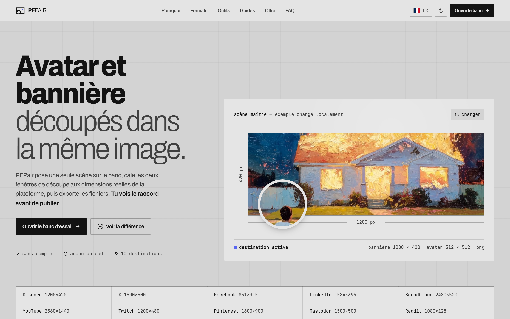
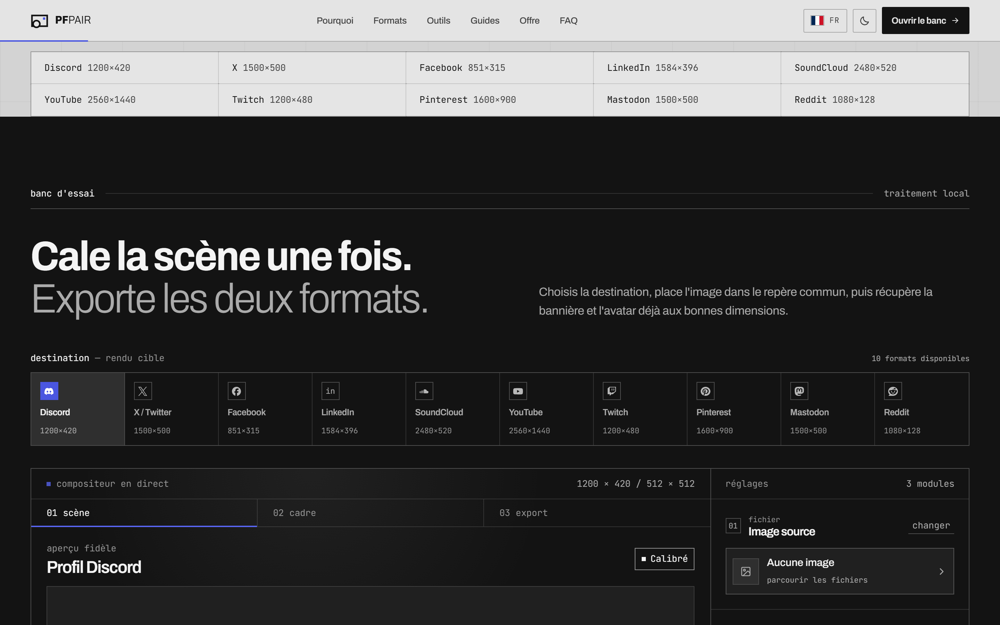
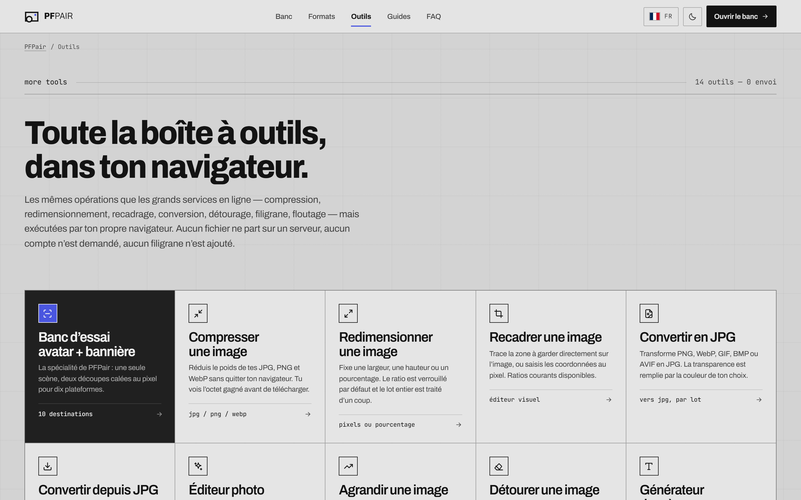
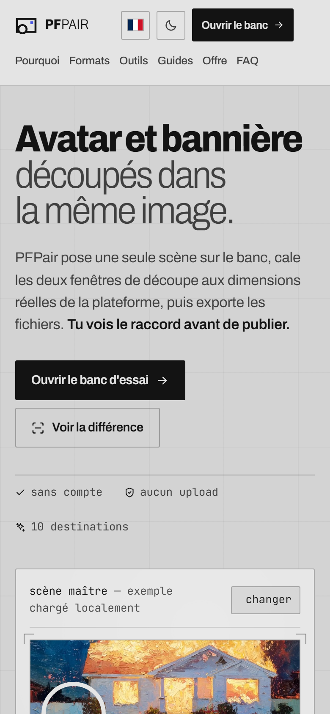

# PFPair Studio — Opus Edition

*[Lire en français](README.md)*

  
  
  
  
  

> **A free web studio to create a perfectly matched avatar and banner from a single image.**  
> Live demo available right away at: **[https://pfpair-opus.vercel.app](https://pfpair-opus.vercel.app)**

---

## 🎯 What is PFPair for?

On Discord, X, LinkedIn or YouTube, the avatar and the banner are two separate images
with different dimensions, yet displayed one on top of the other. Cropping them separately
almost always breaks continuity: a cut-off shoulder doesn't continue, the background
doesn't line up, the profile picture "floats" above the banner.

**PFPair cuts both formats from the same scene.** You import a single image, position it
once, and the site exports the avatar and the banner at the platform's exact dimensions,
aligned to the pixel where the avatar overlaps the banner.

> *A resizer cuts twice. PFPair cuts once.*

### Three steps, under a minute

| Step | Action |
|:---:|---|
| **01 — Import** | Drop a JPG, PNG or WebP photo. It stays in your browser. |
| **02 — Align** | Pick the destination, move and zoom the scene, and check the match live on a preview faithful to the real profile. |
| **03 — Export** | Get a ZIP with both PNGs, correctly named and sized. |

### Who is it for?

- **Discord users** who want a consistent profile (*full profile* and *mini-profile* previews, calibrated on the desktop interface).
- **Creators, streamers and community managers** who need to deploy the same visual identity across several networks.
- **Anyone who wants a fast, private tool**: no account, no watermark, no image sent to a server.

### 10 calibrated platforms

| Platform | Banner | Avatar |
|---|---|---|
| Discord | 1200 × 420 | 512 × 512 |
| X / Twitter | 1500 × 500 | 400 × 400 |
| Facebook | 851 × 315 | 320 × 320 |
| LinkedIn | 1584 × 396 | 400 × 400 |
| SoundCloud, YouTube, Twitch, Pinterest, Mastodon, Reddit | dedicated presets | dedicated presets |

Each preset embeds the measured geometry of the avatar (position, size, shape) so that
the preview matches what the platform actually displays, along with the source used
(official specifications or calibrated interface).

### Verifiable privacy

All processing happens in the browser (canvas). The site's security policy
(`connect-src 'self'`) **technically forbids any outgoing request**: the promise
"no image is sent" is enforced by the browser, not just announced.

### Free model

- **PFPair Free — €0, no account**: 10 platforms, full and compact Discord preview, avatar + banner export as PNG and ZIP, no watermark.
- **PFPair Creator — coming soon**: saved brand kits, variants, batch exports, overlays and client projects. The basic export will always remain free.

---

## 📸 Preview & Interface

| The master scene & the perfect match | The studio & the live compositor |
| :---: | :---: |
|  |  |

| Full toolbox (14 browser tools) | Responsive mobile view |
| :---: | :---: |
|  |  |

---

## 🤖 Two versions, two models — one author

PFPair exists in two versions, both designed by me [bhpdev1](https://github.com/bhpdev1). I developed the same product with two different AI models, to compare their approach to design and engineering on an identical functional base:

- **`pfpair-studio-openai`** — version built with **GPT 5.6 Sol**
- **`pfpair-studio-anthropic`** — **this version**, built with **Claude Opus 5**

The two versions are independent and can run side by side for comparison.

| | GPT 5.6 Sol version (`pfpair-studio-openai`) | **Claude Opus 5 version (`pfpair-studio-anthropic`, this one)** |
|---|---|---|
| Background | graphite `#0b0c0f` + polarized violet/blue WebGL | calibrated neutral grey, chroma 0, plate grid texture |
| Brand accent | PFPair violet `#8a7cf6` | **none** — the only chroma comes from the active destination |
| Typography | Figtree (300–900) | Archivo using the `wdth` axis 86–100 + JetBrains Mono for numbers |
| Geometry | 7–18 px radii, floating perspective cards | sharp corners (0–2 px), 1 px rules, alignment marks |
| Hero | tilted product card, reactive light | plate dimensioned like a technical drawing |
| Formats | grid of 10 cards | 6-column tabular directory |
| Stylesheets | `styles.css` + `pfpair-ui.css` + `seo-pages.css` (~172 KB) | `bench.css` (~62 KB) |

The full art direction, tokens and anti-patterns are in
[`DESIGN.md`](DESIGN.md) (in French).

## What is carried over as-is

- `platforms.js` — the 10 presets, dimensions and measured avatar geometries.
- `app.js` — import, drag, zoom, canvas rendering, dependency-free PNG and ZIP export.
- `visuals.js` — local Lucide icons, Simple Icons logos, scroll reveals,
  example gallery.

## JS changes

They fix defects observed in the browser, not the art direction:

1. `app.js` / `renderPlatformPicker()` — `scrollIntoView({block:"nearest"})` made the whole
   page jump up to the studio on first render. Replaced by a horizontal re-centering of the
   rail (`scrollLeft`).
2. `app.js` / `renderPlatformPicker()` — removed `role="listitem"` on the destination
   buttons: `aria-pressed` is not allowed there. The rail is a `role="group"`.
3. `visuals.js` / `initShowcaseGallery()` — the accessible name of the example-switching
   button did not contain its visible label ("change").
4. `app.js` and `tools.js` / `triggerDownload()` — the blob URL was revoked 1.5 s (studio)
   and 4 s (tools) after the click, and the anchor removed in the same task. If Chrome is
   still reading the blob at that moment — antivirus scan, slow disk, download bar
   prompt — the written file is truncated and opens as garbage pixels. The URL is now kept
   alive until `pagehide`, with a 10-minute safety net, and the anchor is removed on the
   next tick.
5. `app.js` / `draw()` — a decorative 1.25 px outline in the accent color was drawn on the
   avatar's edge, i.e. exactly on the seam of the match. The pixels underneath were
   perfectly continuous, but a colored stroke laid over the joint makes it read as a break.
   Removed: Discord doesn't draw one either, its ring already being simulated by the outer
   circle filled with the profile color.
6. `tools.js` / watermark — anchoring used the font size as the half-width. "PFPair" at
   56 px measures 179 px, so a right-anchored watermark went outside the frame; rotation
   made the overflow worse. Anchoring now measures the actual mark (`measureText` or image
   dimensions) and accounts for the rotated box.

## The tool suite

A **Tools** tab in the navigation opens `tools/`, a directory of fourteen entries:
the native studio plus the thirteen iLoveIMG tools, rebuilt to run entirely in the
browser.

| Tool | Page | Batch | Specificity |
|---|---|:---:|---|
| Compress | `tools/compress-image/` | yes | shows bytes saved before export |
| Resize | `tools/resize-image/` | yes | pixels or percentage, ratio lock |
| Crop | `tools/crop-image/` | — | visual editor + coordinates, 6 ratios |
| Convert to JPG | `tools/convert-to-jpg/` | yes | background color for transparency |
| Convert from JPG | `tools/jpg-to-image/` | yes | to PNG or WebP |
| Photo editor | `tools/photo-editor/` | — | native filters, frame, positionable caption |
| Upscale | `tools/upscale-image/` | — | ×2/×3/×4, successive passes + sharpening |
| Remove background | `tools/remove-background/` | — | fill by diffusion from the edges |
| Meme generator | `tools/meme-generator/` | — | Impact, outline, automatic line wrapping |
| Rotate | `tools/rotate-image/` | yes | quarter turns, mirrors, free angle |
| Watermark | `tools/watermark-image/` | yes | text or logo, 9 positions, tiling |
| Blur | `tools/blur-face/` | — | drawn areas, blur/pixelate/solid fill |
| HTML to image | `tools/html-to-image/` | — | SVG foreignObject, PNG/JPG/SVG output |

### Architecture

A single registry in `tools.js` describes each tool: its controls, its rendering function
and its output format. The engine derives from it the interface, the live preview, batch
processing and export — the HTML pages only contain a
`
`. Adding a tool means adding an entry to the registry
and then regenerating the page.

The ZIP archive is produced by a *store* packer embedded in `tools.js`, with no external
dependency, like the studio's.

### Three deliberate differences from iLoveIMG

These tools bear the same name as their commercial equivalent but rely on a different
technique. This is stated on each relevant page, not only here:

1. **Background removal does not use AI.** It removes pixels close to a reference color by
   diffusion from the edges. Excellent on a plain or studio background, approximate on a
   complex scene.
2. **Upscaling reconstructs nothing.** Multi-pass interpolation with an unsharp mask, no
   generative model: no detail absent from the original appears.
3. **HTML to image starts from pasted code, not a URL.** Capturing a remote site would
   require a rendering server, which PFPair does not use.

The trade-off is deliberate: the upside is that no image leaves the device and that none
of these tools needs a network once the page is loaded.

## Contents

A main page with the studio, a tools directory and its thirteen pages,
and five editorial pages (`discord-pfp-banner-maker/`, `matching-pfp-banner/`,
`discord-banner-size/`, `x-header-avatar-maker/`, `linkedin-profile-kit/`). Dimensions,
official sources and FAQs are carried over; only the page structure and the editorial
voice follow the new direction.

## Checks performed

Chrome 151, viewports 1440 × 900 and 390 × 844:

- Lighthouse **accessibility 100 / best practices 100 / SEO 100** on the main page,
  a guide page, the tools directory and a tool page;
- all thirteen tools tested in the browser: output obtained, correct preview, and export
  verified by binary signature (ZIP `50 4b 03 04`, JPEG `ff d8`, PNG `89 50 4e 47`);
- export chain checked end to end on blurring: the blob is re-decoded and its pixels
  compared to the preview, then the file written to disk is verified for size,
  header and end marker;
- no console messages, no 404 resources;
- no horizontal overflow at 390 px (only the destinations rail scrolls, by design);
- contrast: `--ink-2`, `--ink-3`, `--on-slab-2` and `--on-slab-3` are the lightest values
  that hold 4.5:1 on their respective surfaces — the grey field compresses the usable
  range, the tokens are tuned accordingly;
- `prefers-reduced-motion: reduce` neutralizes transitions, animations and reveals;
- content remains visible if JS fails: the hidden state of reveals is conditioned on the
  `motion-ready` class set by `visuals.js`.

## Licenses

Archivo and JetBrains Mono are distributed under the SIL Open Font License 1.1. Lucide is
under the ISC license. Simple Icons is under CC0-1.0; the depicted brands remain the
property of their owners and are used only to identify export destinations.

## Deployment

Static project: no build, no server dependency. `vercel.json` is already in place
and covers three things.

**`trailingSlash: true`** — all internal links and `sitemap.xml` use URLs ending in `/`
(`/tools/compress-image/`). Without this setting, Vercel would redirect every link with a
308.

**A CSP that makes the privacy promise verifiable.** The site repeats everywhere that no
image is sent; `connect-src 'self'` makes the browser itself enforce it, whatever the
JavaScript does. The other directives strictly allow what the site needs:

| Directive | Why |
|---|---|
| `script-src 'self'` | no third-party scripts, no inline scripts |
| `style-src 'self' 'unsafe-inline' fonts.googleapis.com` | the Google Fonts stylesheet, and styles set by `tools.js` |
| `font-src 'self' fonts.gstatic.com` | Archivo and JetBrains Mono |
| `img-src 'self' data: blob: cdn.jsdelivr.net` | local images, `data:` SVG for HTML-to-image, `blob:` decoding, Simple Icons logos |
| `connect-src 'self'` | **no outgoing request possible** |
| `frame-ancestors 'none'` | the site cannot be embedded in an iframe |

**Long cache on `/assets/`** only: these images never change. The rest keeps the Vercel
default, revalidated on every visit, so that a redeployment is immediately visible.

---

## 📄 License & Rights

This repository is the public showcase and technical documentation of the **PFPair** project.  
The application's full source code is maintained in a private proprietary repository.

All rights reserved © 2026.

## 👤 Credits

Developed by [bhpdev1](https://github.com/bhpdev1)
